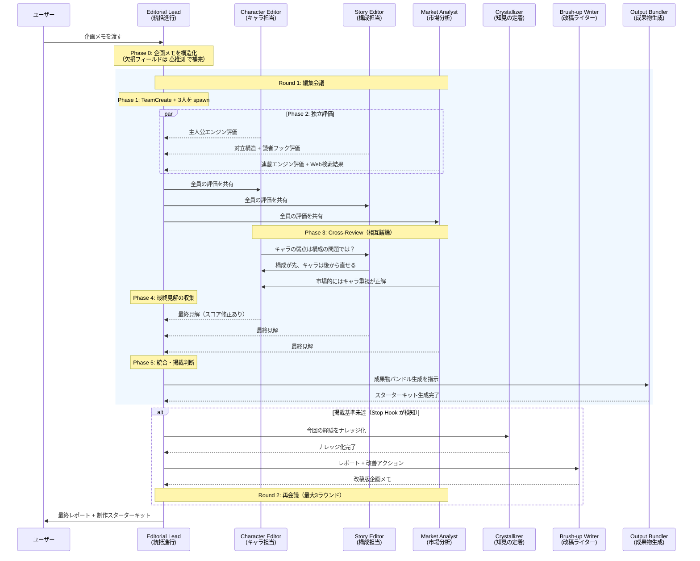
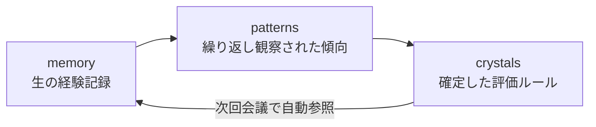

# Manga Editorial Meeting

漫画の企画メモを渡すだけで、AI 編集者チームが自動で編集会議を開催し、掲載判断まで出力する Claude Code Plugin。
使い込むほど賢くなる NFD メモリで、あなた専属の編集部が育つ。

7体の AI エージェントが AgentTeams でリアルタイムに議論し、4軸スコア評価・改善提案・掲載判断レポートを生成します。
会議を重ねるごとに [NFD（Nurture-First Development）](https://arxiv.org/abs/2603.10808) 三層メモリで経験を蓄積し、評価精度が向上します。

## できること

| 機能 | 内容 |
|------|------|
| 4軸スコア評価 | 主人公エンジン・対立構造・読者フック・連載エンジンを各10点で採点 |
| 編集者間の議論 | 3人の専門編集者が SendMessage で直接やりとり。反論・補足が飛び交う臨場感 |
| 掲載判断 | スコアに基づく自動判定（掲載 / 条件付き通過 / 保留 / 却下） |
| 自動ブラッシュアップ | 掲載基準未達なら企画を自動改稿して再会議（最大3ラウンド） |
| 改善提案 | 優先度付きの具体的アクションリスト |
| 市場調査 | Web検索による類似作品・トレンド分析 |
| 成長する AI | NFD 三層メモリで会議ごとに学習。多ジャンルでオールラウンダーに、特定ジャンル特化でスペシャリストに |
| 制作スターターキット | 企画メモ・レポート・キャラ設定・画像生成プロンプトを一括出力 |
| デモモード | 引数なし or `demo` で企画メモを自動生成して体験可能 |

## 必要環境

- Claude Code v2.1 以上
- `CLAUDE_CODE_EXPERIMENTAL_AGENT_TEAMS=1` 環境変数
- `--dangerously-skip-permissions` フラグ（動的コンテキスト注入に必要）

```bash
CLAUDE_CODE_EXPERIMENTAL_AGENT_TEAMS=1 claude --dangerously-skip-permissions --plugin-dir ./plugins/manga-editorial-meeting
```

## デモ動画

<!-- TODO: 提出前にデモ動画を撮影してリンクを差し替える（3分以内） -->
[デモ動画を見る](https://example.com/demo)

## インストール

```bash
# Claude Code 内で実行
/plugin marketplace add KIRIKO-HirokiSato/manga-editorial
/plugin install manga-editorial-meeting@manga-editorial
```

## 使い方

### 企画メモを渡して会議を開始

```bash
/editorial-meeting タイトル: 深海カフェ / コンセプト: 海底1万メートルに沈んだ喫茶店を営む少女の日常
```

2行のメモでも会議は成立します。詳細な企画書を渡せば、より精度の高い評価が得られます。

### デモモードで試す

```bash
/editorial-meeting demo
```

企画が思いつかなくても大丈夫。デモモードでは企画メモを自動生成して、プラグインの全機能を体験できます。

### 出力例

```
📋 漫画編集会議レポート: 深海カフェ

■ 4軸スコア
  主人公エンジン:  7/10  — 「日常を守る動機」が明確
  対立構造:        5/10  — 外的脅威が弱い
  読者フック:      8/10  — 世界観の独自性が強い
  連載エンジン:    6/10  — エピソード展開の幅に課題

■ 掲載判断: 条件付き通過
  → 対立構造の強化で掲載ラインへ

■ 改善アクション
  1. [高] 海底世界を脅かす外的勢力の導入
  2. [中] 主人公の過去と喫茶店の謎を連載軸に
  3. [低] サブキャラクターの動機を深堀り
```

## 成果物: 漫画制作スターターキット

会議が完了すると、漫画制作に必要なファイル一式が `output/` に自動生成されます。

```
output/2026-03-17_深海カフェ/
├── proposal.md                最終版企画メモ（改稿済み）
├── report.md                  編集会議レポート全文
├── score-history.csv          ラウンド別スコア推移データ
├── characters/
│   ├── 深町珊.md              主人公の詳細設定シート
│   ├── 安岐晴彦.md            対立キャラの詳細設定シート
│   └── ...
└── prompts/
    └── character-visuals.md   画像生成AI用プロンプト集
```

| ファイル | 用途 |
|----------|------|
| `proposal.md` | 編集部持ち込み・次工程への入力 |
| `report.md` | 会議記録の保存・振り返り |
| `score-history.csv` | ラウンド別4軸スコア推移。スプレッドシートでグラフ化して改善傾向を可視化 |
| `characters/*.md` | キャラデザ発注・脚本作成の参考資料 |
| `prompts/character-visuals.md` | NanoBanana2 等の画像生成AIでキャラビジュアルを生成 |

## 動作の流れ



## NFD: 使うほど賢くなる AI 編集部

このプラグインは [NFD（Nurture-First Development）](https://arxiv.org/abs/2603.10808) に基づく三層メモリアーキテクチャを内蔵しています。会議を重ねるごとにロール別の経験が蓄積・ナレッジ化され、評価精度と提案の具体性が向上します。

### 三層メモリ



| 層 | 内容 | トリガー |
|----|------|----------|
| memory | 会議ごとの生の経験記録（ロール別 + 共通） | 毎会議自動保存 |
| patterns | 繰り返し観察されたパターン・傾向 | memory 3件以上でナレッジ化を推奨 |
| crystals | 確定した評価ルール・知見 | 複数ロールで確認された知見が昇格 |

### ロール別メモリ: 各編集者が独自に成長する

5つの独立チャネル（character-editor / story-editor / market-analyst / editorial-lead / common）がそれぞれ経験を蓄積します。キャラ担当は「主人公空洞パターン」を、市場分析担当は「差別化ゼロの連載エンジン減算」を——というように、専門性が深化していきます。

### あなたの使い方で、編集部の個性が変わる

- **オールラウンダー型**: バトル、日常、ギャグ、ファンタジーと幅広いジャンルを持ち込むと、ジャンル横断の汎用パターンが知見として定着。どんな企画にも的確なフィードバックを返す万能編集部に
- **スペシャリスト型**: 格闘系・バトル系の企画を中心に持ち込めば、「対立構造のエスカレーション設計」「パワーカーブの天井問題」等、そのジャンル固有の評価基準が蓄積。特化型の鋭い編集部に

### 定着した知見の実例

実際に3作品・5回の会議から定着した知見:

> **侵食/変容メカニクスの終着点設計必須（三点設計）**: 変容の起点だけ書かれて終点が未設計のパターンは「半設計」。連載エンジンとして機能するには「起点・変化の方向・終着点」の三点が必要。
> ——4ロール独立合意で定着

> **初動フックと継続フックの独立評価**: タイトルのキャッチーさは初回購買力として機能するが、毎話継続フックとは独立した評価軸。タイトルフック高/継続フック低の企画は1話切りリスクが高い。
> ——4ロール独立合意で定着

## 評価軸の詳細

| 軸 | 担当 | 観点 |
|----|------|------|
| 主人公エンジン | Character Editor | 動機の明確さ・内的葛藤・共感性・成長余地・弱点の魅力 |
| 対立構造 | Story Editor | 対立の多層性・ステークス・エスカレーション・テーマとの連動 |
| 読者フック | Story Editor | 冒頭の引き・謎の設計・ページめくり構造・感情の起伏 |
| 連載エンジン | Market Analyst | 敵の階層構造・パワーカーブ・エピソードのバリエーション・中期ビジョン |

## Repository Structure

```
manga-editorial/
├── .claude-plugin/
│   └── marketplace.json
├── plugins/manga-editorial-meeting/
│   ├── .claude-plugin/plugin.json
│   ├── agents/
│   │   ├── editorial-lead.md        # 統括進行役（Opus）
│   │   ├── character-editor.md      # キャラ担当（Sonnet）
│   │   ├── story-editor.md          # 構成担当（Sonnet）
│   │   ├── market-analyst.md        # 市場分析（Sonnet）
│   │   ├── brush-up-writer.md       # 企画改稿ライター（Sonnet）
│   │   ├── output-bundler.md        # 成果物パッケージャー（Sonnet）
│   │   └── crystallizer.md          # NFD ナレッジ化（Sonnet）
│   ├── hooks/
│   │   ├── hooks.json               # Stop Hook 定義
│   │   ├── quality-gate.sh          # 品質ゲート（必須項目チェック）
│   │   └── nfd-checkpoint.sh        # NFD メモリ永続化
│   ├── skills/editorial-meeting/
│   │   ├── SKILL.md                 # Skill 本体
│   │   └── references/
│   │       ├── scoring-rubric.md    # 4軸採点基準
│   │       └── report-template.md   # レポートテンプレート
│   ├── scripts/
│   │   └── check-crystallization.sh # NFD ナレッジ化トリガー
│   ├── output/                      # 成果物バンドル（実行時に生成）
│   │   └── {日付}_{タイトル}/       # 企画ごとのスターターキット
│   └── nfd/                         # 三層メモリ（実行時に蓄積）
│       ├── memory/                  # 生の経験記録
│       │   ├── common/              # 全エージェント共有の会議記録
│       │   ├── character-editor/    # キャラ担当の振り返り
│       │   ├── story-editor/        # 構成担当の振り返り
│       │   ├── market-analyst/      # 市場分析担当の振り返り
│       │   └── editorial-lead/      # 統括進行の振り返り
│       ├── patterns/                # 抽出パターン（ロール別 .md）
│       └── crystals/                # 確定知識（ロール別 .md）
├── mock/                            # 設計書・UI デモ（参考資料）
└── README.md
```

## 技術的な特徴

- **AgentTeams**: 7体のエージェントで構成。3人の専門編集者（character-editor / story-editor / market-analyst）が SendMessage で直接議論し、残り3体（brush-up-writer / output-bundler / crystallizer）は統括進行役（editorial-lead）からのタスク委任で動作
- **Stop Hook ブラッシュアップループ**: 掲載基準未達を検知 → 自動改稿 → 再会議を最大3ラウンド
- **Stop Hook 品質ゲート**: レポート出力時に4軸スコア・掲載判断・改善提案の存在を自動検証
- **動的コンテキスト注入**: SKILL.md の `` !`command` `` 記法で NFD メモリ状況をスキル起動時に自動チェック
- **NFD 三層アーキテクチャ**: ロール別メモリ + 共通メモリ + 自動ナレッジ化でプラグインが成長
- **制作スターターキット**: 企画メモ・レポート・キャラ設定シート・画像生成プロンプトを一括出力

## License

MIT
