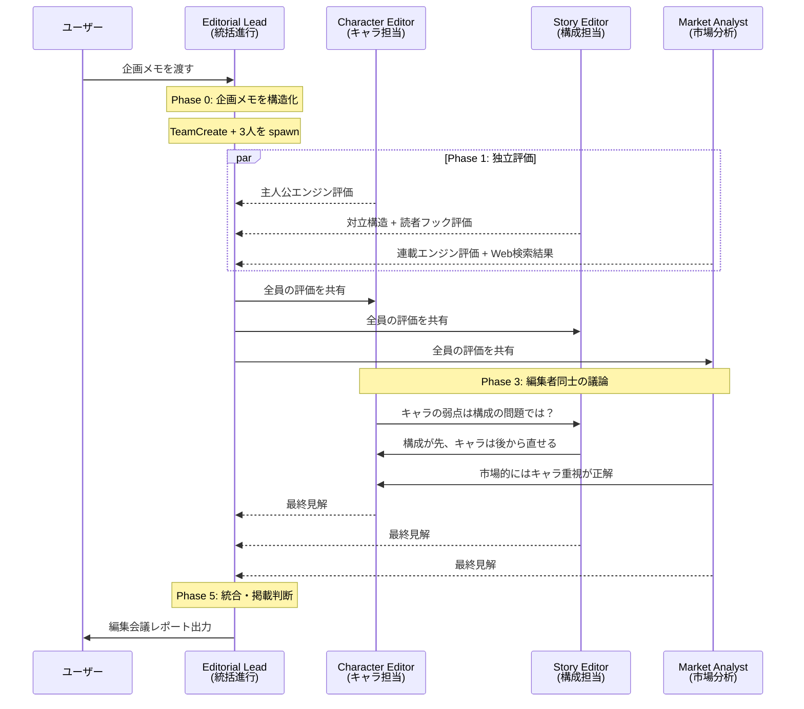

# Manga Editorial Meeting

漫画の企画メモを渡すだけで、AI 編集者チームが自動で編集会議を開催し、掲載判断まで出力する Claude Code Plugin。

3人の AI 編集者が AgentTeams でリアルタイムに議論し、4軸スコア評価・改善提案・掲載判断レポートを生成します。
会議を重ねるごとに NFD（Nurture-First Development）三層メモリで経験を蓄積し、評価精度が向上します。

## できること

| 機能 | 内容 |
|------|------|
| 4軸スコア評価 | 主人公エンジン・対立構造・読者フック・連載エンジンを各10点で採点 |
| 編集者間の議論 | 3人の専門編集者が SendMessage で直接やりとり。反論・補足が飛び交う臨場感 |
| 掲載判断 | スコアに基づく自動判定（掲載 / 条件付き通過 / 保留 / 却下） |
| 改善提案 | 優先度付きの具体的アクションリスト |
| 市場調査 | Web検索による類似作品・トレンド分析 |
| 成長するAI | NFD 三層メモリ（memory → patterns → crystals）で会議ごとに学習 |
| デモモード | 引数なし or `demo` で企画メモを自動生成して体験可能 |

## インストール

```bash
# Claude Code 内で実行
/plugin marketplace add <your-github-user>/manga
/plugin install manga-editorial-meeting@manga-editorial
```

## 使い方

### 企画メモを渡して会議を開始

```bash
/editorial-meeting タイトル: 深海カフェ / コンセプト: 海底1万メートルに沈んだ喫茶店を営む少女の日常
```

2行のメモでも会議は成立します。詳細な企画書を渡せば、より精度の高い評価が得られます。

### デモモードで試す

```bash
/editorial-meeting demo
```

企画が思いつかなくても大丈夫。デモモードでは企画メモを自動生成して、プラグインの全機能を体験できます。

### 出力例

```
📋 漫画編集会議レポート: 深海カフェ

■ 4軸スコア
  主人公エンジン:  7/10  — 「日常を守る動機」が明確
  対立構造:        5/10  — 外的脅威が弱い
  読者フック:      8/10  — 世界観の独自性が強い
  連載エンジン:    6/10  — エピソード展開の幅に課題

■ 掲載判断: 条件付き通過
  → 対立構造の強化で掲載ラインへ

■ 改善アクション
  1. [高] 海底世界を脅かす外的勢力の導入
  2. [中] 主人公の過去と喫茶店の謎を連載軸に
  3. [低] サブキャラクターの動機を深堀り
```

## 動作の流れ



## NFD: 使うほど賢くなる

このプラグインは NFD（Nurture-First Development）三層メモリを内蔵しています。

```
memory/     会議ごとの生の経験記録（ロール別 + 共通）
  ↓ 3件以上蓄積で自動トリガー
patterns/   繰り返し観察されたパターン・傾向
  ↓ 3回以上確認で昇格
crystals/   確定した評価ルール・知見
```

- 各編集者が自分の専門領域の気づきを個別に記録
- 2回目以降の会議で過去の知見を自動参照
- 同一タイトルの再投入時にはスコア推移を比較表示
- 結晶化エージェント（crystallizer）が memory → patterns → crystals の昇格を自動実行

## 必要環境

- Claude Code v2.1 以上
- `CLAUDE_CODE_EXPERIMENTAL_AGENT_TEAMS=1` 環境変数
- `--dangerously-skip-permissions` フラグ（動的コンテキスト注入に必要）

```bash
CLAUDE_CODE_EXPERIMENTAL_AGENT_TEAMS=1 claude --dangerously-skip-permissions --plugin-dir ./plugins/manga-editorial-meeting
```

## 評価軸の詳細

| 軸 | 担当 | 観点 |
|----|------|------|
| 主人公エンジン | Character Editor | 動機の明確さ・内的葛藤・共感性・成長余地・弱点の魅力 |
| 対立構造 | Story Editor | 対立の多層性・ステークス・エスカレーション・テーマとの連動 |
| 読者フック | Story Editor | 冒頭の引き・謎の設計・ページめくり構造・感情の起伏 |
| 連載エンジン | Market Analyst | 敵の階層構造・パワーカーブ・エピソードのバリエーション・中期ビジョン |

## Repository Structure

```
manga/
├── .claude-plugin/
│   └── marketplace.json
├── plugins/manga-editorial-meeting/
│   ├── .claude-plugin/plugin.json
│   ├── agents/
│   │   ├── editorial-lead.md        # 統括進行役（Opus）
│   │   ├── character-editor.md      # キャラ担当（Sonnet）
│   │   ├── story-editor.md          # 構成担当（Sonnet）
│   │   ├── market-analyst.md        # 市場分析（Sonnet）
│   │   └── crystallizer.md          # NFD 結晶化（Sonnet）
│   ├── hooks/
│   │   ├── hooks.json               # Stop Hook 定義
│   │   └── quality-gate.sh          # 品質ゲート（必須項目チェック）
│   ├── skills/editorial-meeting/
│   │   ├── SKILL.md                 # Skill 本体
│   │   └── references/
│   │       ├── scoring-rubric.md    # 4軸採点基準
│   │       └── report-template.md   # レポートテンプレート
│   ├── scripts/
│   │   └── check-crystallization.sh # NFD 結晶化トリガー
│   └── nfd/                         # 三層メモリ（実行時に蓄積）
│       ├── memory/                  # 生の経験記録
│       ├── patterns/                # 抽出パターン
│       └── crystals/                # 確定知識
├── mock/                            # 設計書・UI デモ（参考資料）
└── README.md
```

## 技術的な特徴

- **AgentTeams**: 5つのエージェントが SendMessage で直接対話。議論の臨場感を再現
- **Stop Hook 品質ゲート**: レポート出力時に4軸スコア・掲載判断・改善提案の存在を自動検証
- **動的コンテキスト注入**: `!` コマンドで NFD メモリ状況をスキル起動時に自動チェック
- **NFD 三層アーキテクチャ**: ロール別メモリ + 共通メモリ + 自動結晶化でプラグインが成長

## License

MIT
