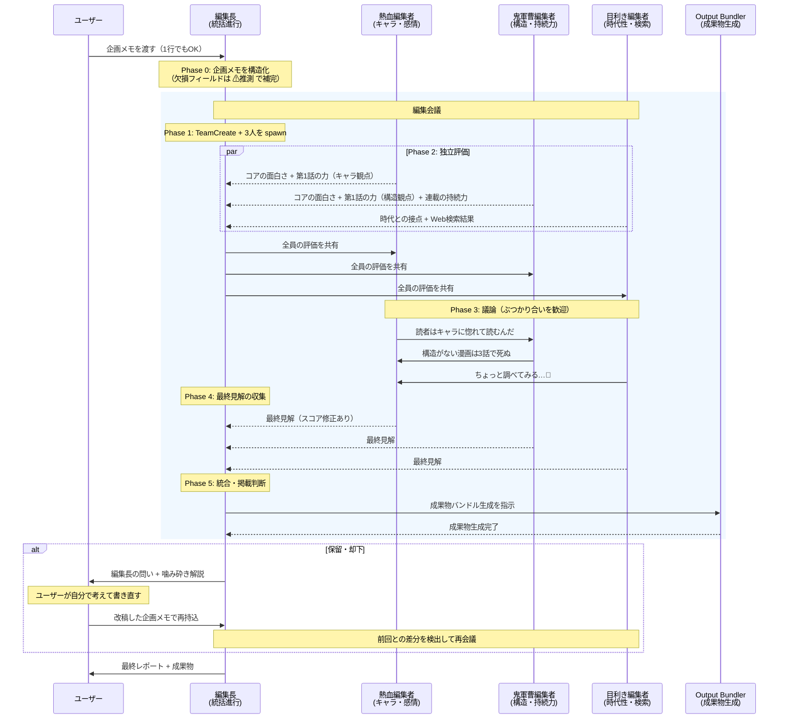
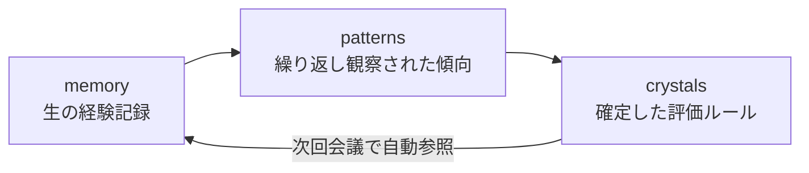

# Manga Editorial Meeting

**「AIは答えを渡さない。問いを投げて、漫画家を育てる。」**

漫画の企画メモを渡すだけで、AI 編集者3人＋編集長が本気で議論し、掲載判断を下す Claude Code Plugin。
却下されたら、編集長が「何を考えてこい」と問いを渡す。漫画家が自分で考え、書き直し、再持込する。

6体の AI エージェントが AgentTeams でリアルタイムに議論。
使い込むほど [NFD（Nurture-First Development）](https://arxiv.org/abs/2603.10808) 三層メモリで経験を蓄積し、あなた専属の編集部が育つ。

## できること

| 機能 | 内容 |
|------|------|
| 4軸スコア評価 | コアの面白さ・第1話の力・連載の持続力・時代との接点を各10点で採点 |
| 編集者間の議論 | 熱血編集者・鬼軍曹編集者・目利き編集者が SendMessage で直接議論。反論・補足が飛び交う |
| 5段階の掲載判断 | 掲載 / 条件付き通過 / 保留 / 却下 / 見送り。面白ければ Round 1 でも掲載を出す |
| 問いの提示 | 却下・保留時、改善案ではなく「漫画家が自分で考えるための問い」を出す |
| 問いの噛み砕き | 編集長の問いを素人向けに翻訳。考え方のヒント付き。ただし答えは渡さない |
| 再持込対応 | 前回の問いに対する改善を自動検出。成長を認めた上で新たな課題へ |
| 市場調査 | 目利き編集者が Web検索で類似作品・トレンドを調査 |
| 成長する AI | NFD 三層メモリで会議ごとに学習。あなた専属の編集部が育つ |
| デモモード | 引数なし or `demo` で企画メモを自動生成して体験可能 |

## 必要環境

- Claude Code v2.1 以上
- `CLAUDE_CODE_EXPERIMENTAL_AGENT_TEAMS=1` 環境変数
- `--dangerously-skip-permissions` フラグ（動的コンテキスト注入に必要）

```bash
CLAUDE_CODE_EXPERIMENTAL_AGENT_TEAMS=1 claude --dangerously-skip-permissions --plugin-dir ./plugins/manga-editorial-meeting
```

## デモ動画

<!-- TODO: 提出前にデモ動画を撮影してリンクを差し替える（3分以内） -->
[デモ動画を見る](https://example.com/demo)

## インストール

```bash
# Claude Code 内で実行
/plugin marketplace add KIRIKO-HirokiSato/manga-editorial
/plugin install manga-editorial-meeting@manga-editorial
```

## 使い方

### 企画メモを渡して会議を開始

```bash
/editorial-meeting タイトル: 深海カフェ / コンセプト: 海底1万メートルに沈んだ喫茶店を営む少女の日常
```

1行のアイデアでも会議は成立します。雑な入力でも ⚠推測マーク付きで補完して進行します。

### デモモードで試す

```bash
/editorial-meeting demo
```

企画が思いつかなくても大丈夫。デモモードでは企画メモを自動生成して、プラグインの全機能を体験できます。

### 出力例

```
📋 漫画編集会議レポート: 深海カフェ

■ 4軸スコア
  コアの面白さ:  7/10  — 「深海×カフェ」の組み合わせは新鮮
  第1話の力:     4/10  — 掴みが弱い。何が起きるかが見えない
  連載の持続力:  3/10  — 「客が来る→話す→帰る」では持たない
  時代との接点:  6/10  — 日常系ファンタジーは堅調

■ 掲載判断: 却下（再持込可）

■ 編集長の問い
  ① この子が深海にいる理由
    → 読者が共感できる理由か？
  ② 日常が変わるきっかけ
    → 物語が動き出す瞬間は何か？
  ③ 10話後にこの漫画がどうなっているか
    → 連載の持続力。1話目と10話目で何が変わっている？
```

## 成果物

会議が完了すると、成果物が `output/` に自動生成されます。

```
output/2026-03-22_深海カフェ/
├── proposal.md          企画メモ
├── report.md            編集会議レポート全文
├── score-history.csv    スコア推移データ
└── questions.md         編集長の問い + 噛み砕き解説（該当時のみ）
```

| ファイル | 用途 |
|----------|------|
| `proposal.md` | 編集部持ち込み・次工程への入力 |
| `report.md` | 会議記録の保存・振り返り |
| `score-history.csv` | スコア推移。スプレッドシートでグラフ化して改善傾向を可視化 |
| `questions.md` | 編集長の問い + 考え方のヒント。再持込の出発点 |

## 動作の流れ



## 差別化

| 既存のAI創作ツール | 本 Plugin |
|---|---|
| ストーリーを「作る」 | ストーリー構造を「検証する」 |
| 完全な入力を要求 | 1行でも会議が始まる |
| 1回の評価で完結 | 何度でも再持込できる |
| スコアと改善案を出す | 「問い」を投げて作者に考えさせる |
| AIが直してくれる | AIは考え方を教える。直すのは漫画家 |
| 汎用的なフィードバック | ジャンル別の評価基準 |
| 結果だけ返す | 編集者同士の議論過程が見える |
| 使い終わったら終わり | NFD メモリで編集部が成長する |

## NFD: 使うほど賢くなる AI 編集部

このプラグインは [NFD（Nurture-First Development）](https://arxiv.org/abs/2603.10808) に基づく三層メモリアーキテクチャを内蔵しています。会議を重ねるごとにロール別の経験が蓄積・ナレッジ化され、評価精度と提案の具体性が向上します。

### 三層メモリ



| 層 | 内容 | トリガー |
|----|------|----------|
| memory | 会議ごとの生の経験記録（ロール別 + 共通） | 毎会議自動保存 |
| patterns | 繰り返し観察されたパターン・傾向 | memory 3件以上でナレッジ化を推奨 |
| crystals | 確定した評価ルール・知見 | 複数ロールで確認された知見が昇格 |

### あなたの使い方で、編集部の個性が変わる

- **オールラウンダー型**: 幅広いジャンルを持ち込むと、ジャンル横断の汎用パターンが定着
- **スペシャリスト型**: 特定ジャンルを中心に持ち込めば、そのジャンル固有の評価基準が蓄積

## 評価軸の詳細

| 軸 | 担当 | 観点 |
|----|------|------|
| コアの面白さ | 熱血 + 鬼軍曹 | 「一言で言うと何が面白い？」が明確か |
| 第1話の力 | 熱血 + 鬼軍曹 | 1話で読者を掴む設計ができているか |
| 連載の持続力 | 鬼軍曹 | 2巻、5巻、10巻と続くエンジンがあるか |
| 時代との接点 | 目利き | 今の読者に届くか。類似作品との差別化 |

## Repository Structure

```
manga-editorial/
├── .claude-plugin/
│   └── marketplace.json
├── plugins/manga-editorial-meeting/
│   ├── .claude-plugin/plugin.json
│   ├── agents/
│   │   ├── editorial-lead.md        # 編集長（Opus）
│   │   ├── character-editor.md      # 熱血編集者（Sonnet）
│   │   ├── story-editor.md          # 鬼軍曹編集者（Sonnet）
│   │   ├── market-analyst.md        # 目利き編集者（Sonnet）
│   │   ├── output-bundler.md        # 成果物パッケージャー（Sonnet）
│   │   └── crystallizer.md          # NFD ナレッジ化（Sonnet）
│   ├── hooks/
│   │   ├── hooks.json               # Hook 定義
│   │   └── nfd-checkpoint.sh        # NFD メモリ永続化
│   ├── skills/editorial-meeting/
│   │   ├── SKILL.md                 # Skill 本体
│   │   └── references/
│   │       ├── scoring-rubric.md    # 4軸採点基準（ジャンル対応）
│   │       └── report-template.md   # レポートテンプレート
│   ├── scripts/
│   │   └── check-crystallization.sh # NFD ナレッジ化トリガー
│   ├── output/                      # 成果物（実行時に生成）
│   └── nfd/                         # 三層メモリ（実行時に蓄積）
│       ├── memory/
│       ├── patterns/
│       └── crystals/
├── mock/                            # 設計書（参考資料）
└── README.md
```

## 技術的な特徴

- **AgentTeams**: 6体のエージェントで構成。3人の専門編集者が SendMessage で直接議論し、残り2体（output-bundler / crystallizer）は編集長からのタスク委任で動作
- **問い形式のフィードバック**: 改善案ではなく問いを出す。漫画家が自分で考える設計
- **5段階掲載判断**: 機械的閾値ではなく編集長の総合判断。面白ければ Round 1 でも掲載
- **再持込対応**: 前回の問い・スコアとの差分を自動検出。成長を認めた上で新たな課題へ
- **動的コンテキスト注入**: SKILL.md の `` !`command` `` 記法で NFD メモリ状況を自動チェック
- **NFD 三層アーキテクチャ**: ロール別メモリ + 共通メモリ + 自動ナレッジ化でプラグインが成長

## License

MIT
